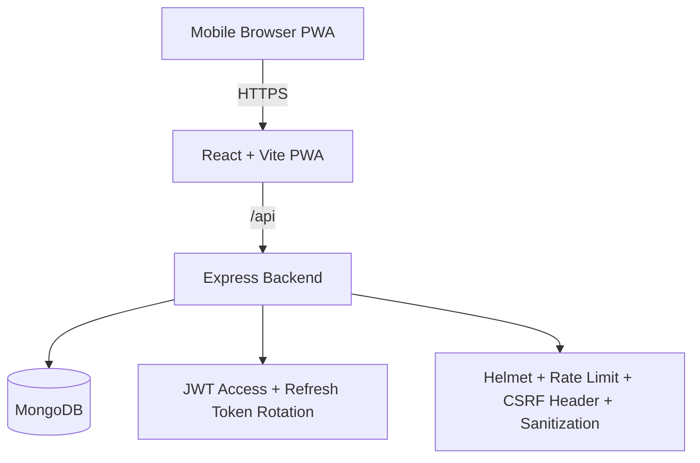

# System Map (Source of Truth: PROJECT_AUDIT.md)

## 1. Logical Architecture

## 2. Module Breakdown

- frontend-web (`web/`)
- SPA, mobile-first UI, admin and client experiences, offline-capable PWA.
- state: local React state + session storage helpers in `web/src/lib/api.ts`.
- routing: React Router path-based navigation.

- backend-api (`backend/`)
- Express modular route architecture.
- authentication/authorization: JWT + role guards.
- data access: Mongoose models.

- infra (`docker-compose.yml`, `deploy/`, `.github/workflows/`)
- dockerized services for frontend/backend/database.
- CI/CD builds/pushes images and deploys over SSH to EC2.

## 3. API Endpoints

Base: `/api`

- health
- `GET /health`

- auth
- `POST /auth/register`
- `POST /auth/login`
- `POST /auth/refresh`
- `POST /auth/logout`
- `POST /auth/logout-all`

- users
- `GET /users/profile`
- `PUT /users/profile`
- `GET /users`
- `POST /users`
- `PUT /users/:id`
- `DELETE /users/:id`
- `PUT /users/:id/deactivate`
- `PUT /users/:id/activate`

- services
- `GET /services`
- `GET /services/category/:category`
- `GET /services/:id`
- `POST /services`
- `PUT /services/:id`
- `DELETE /services/:id`

- team
- `GET /team`

- schedule
- `GET /schedule/available`
- `GET /schedule`
- `GET /schedule/:date`
- `PUT /schedule`

- session
- `GET /session`
- `POST /session/open`
- `PUT /session/close`
- `GET /session/dashboard`

- bookings and public slots
- `GET /time-slots`
- `POST /bookings`
- `GET /bookings` (admin)

- appointments
- `POST /appointments`
- `POST /appointments/reserve` (admin)
- `GET /appointments/my`
- `PUT /appointments/:id/cancel`
- `GET /appointments` (admin)
- `GET /appointments/:id` (admin)
- `PUT /appointments/:id` (admin)
- `PUT /appointments/:id/complete` (admin)
- `PUT /appointments/:id/in-service` (admin)
- `PUT /appointments/:id/no-show` (admin)
- `DELETE /appointments/:id` (admin)

- queue
- `GET /queue`
- `PUT /queue/reorder` (admin)

## 4. Database Schema (Current Runtime)

MongoDB collections:
- `users`: account, role, status.
- `refreshtokens`: hashed refresh token rotation table with TTL expiry.
- `services`: service catalog and pricing.
- `teammembers`: public staff catalog.
- `schedules`: day-level availability and slot configuration.
- `sessions`: open/close salon day state.
- `bookings`: public and authenticated appointments + queue metadata.

Key relations (logical):
- user 1..n bookings via `bookings.userId`.
- user 1..n refresh tokens via `refreshtokens.userId`.
- schedules and sessions keyed by date.

## 5. Feature to Code Mapping

- authentication and session lifecycle
- `backend/src/routes/auth.routes.ts`
- `backend/src/models/User.ts`
- `backend/src/models/RefreshToken.ts`
- `web/src/lib/api.ts`

- booking flow and timeslot availability
- `backend/src/routes/booking.routes.ts`
- `backend/src/routes/appointment.routes.ts`
- `backend/src/models/Booking.ts`
- `web/src/pages/BookingPage.tsx`
- `web/src/pages/AppointmentsPage.tsx`

- admin operations
- `web/src/pages/AdminDashboardPage.tsx`
- `web/src/pages/AdminServiceManagementPage.tsx`
- `web/src/pages/AdminAppointmentManagementPage.tsx`
- `web/src/pages/AdminQueueManagementPage.tsx`
- `web/src/pages/AdminUserManagementPage.tsx`

- queueing
- `backend/src/routes/queue.routes.ts`
- `backend/src/routes/helpers.ts` (`resequenceQueue`)
- `web/src/pages/QueuePage.tsx`

- schedule and sessions
- `backend/src/routes/schedule.routes.ts`
- `backend/src/routes/session.routes.ts`
- `backend/src/models/Schedule.ts`
- `backend/src/models/Session.ts`

- pwa behavior
- `web/vite.config.ts`
- `web/src/index.tsx`
- `web/index.html`

## 6. Third-Party Integrations

- runtime libraries
- MongoDB / Mongoose
- JWT / bcrypt
- Axios
- Tailwind CSS
- Framer Motion
- vite-plugin-pwa + Workbox

- infrastructure integrations
- Docker and Docker Compose
- GHCR image registry
- GitHub Actions
- EC2 over SSH

## 7. Android-Specific Detection

- The repository originally contained Expo React Native mobile code under `mobile/`.
- There were no custom native Android Activities/Fragments/ViewModels/XML layouts in active use.
- Migration target is now PWA-only web runtime for mobile browsers.
